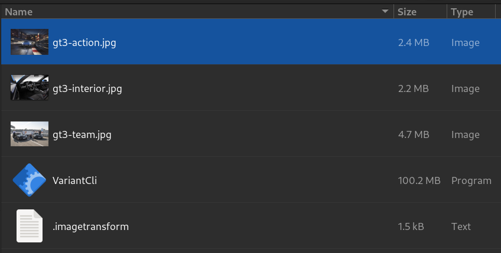
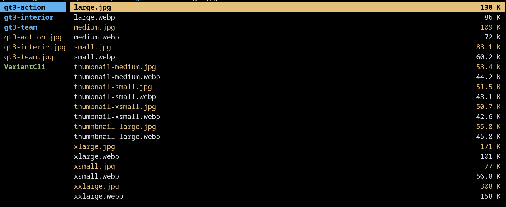

# Variant CLI

## A CLI for producing image set renditions using ImageMagick

Problem statement:
> - Optimizing images for web is difficult for developers without external software
> - Producing srcset optimized renditions of images can be tedious
> - Cloud/SaaS services for automating this function are expensive
> - Naming is hard
> - Keeping track of which assets are and are not optimized is hard

This tool attempts to solve the access and ease concerns by creating an output image set renditions based on a transform
specification. Images are converted to an optimized form for web viewing, and multiple renditions are created at the
same time.

#### tl;dr?

> Start with this



> Run this

```bash
./VariantCli --path ./dir-with-images
``` 

> Get this



### Optimization

VariantCLI applies the following canned optimizations:

- best effort, lossless compression by file type
- DPI downsampling to web dpi (72) when needed
- Relative quality reduced to 75 for additional size reduction with negligible impact on apparent quality

A future effort will be made to make these options configurable.

### Rendition Naming

**Example**

Given a single image file with a name of a-picture-name.png, Variant-Cli will produce the following

```javascript
a - picture - name / 1200
px.WebP
a - picture - name / 1080
px.WebP
a - picture - name / 980
px.WebP
a - picture - name / 720
px.WebP

//or, if variation names are specified

a - picture - name / xlarge.WebP
a - picture - name / large.WebP
a - picture - name / medium.WebP
a - picture - name / smol.WebP
```

### Practical Usage

Predictable, conventional asset naming makes UI tooling and creation easier while reducing the potential for human
error.

Example usage in front-end cases:

```html
// Simple Image

// Image with srcset

```

Markup After

```jsx
// Simple image

// Image with srcset

```

### Getting Started

#### Process

- You supply an image or directory of images to convert
- You supply a transformation definition that will be applied to all images
- It produces the images you need in various format

### What file types are supported?

```
jpg, png, webp
```

Many more planned for the future.

### Commands

#### generate

Creates the image set according to the image transform configuration.

```bash
# Creates image sets in the TestData directory
./VariantCli generate --path './TestData'
# Creates an image set of the specified file
./VariantCli generate --path './TestData/source-image.png'
```

#### Init

Creates a default image transform file at the site of execution

```bash
# Creates a .imagetransform file in ~/temp-dir
cd ~/temp-dir
./VariantCli init
```

### Configuration

The .imagetransform configuration file defines which variants are produced on the output. This file is required for the
application to work.

You can provide a specific file for this information using the `--transformconfig` argument, or a .imagetransform file
with the correct schema (json) in the folder indicated by path.

#### Schema (json)

```javascript
[
    {
        "PixelWidth": 1200, // number of pixels wide the output variation should be
        "TargetFormat": "Jpg", // Jpg, Png, WebP
        "Variation Name": "smol" // a name for the image variation
    }
]
```

#### Example .imagetransform

```json
[
  {
    "PixelWidth": 980,
    "TargetFormat": "WebP",
    "VariationName": "large"
  },
  {
    "PixelWidth": 768,
    "TargetFormat": "WebP",
    "VariationName": "medium"
  },
  {
    "PixelWidth": 540,
    "TargetFormat": "WebP",
    "VariationName": "small"
  },
  {
    "PixelWidth": 200,
    "TargetFormat": "WebP",
    "VariationName": "thumnbnail-large"
  },
  {
    "PixelWidth": 150,
    "TargetFormat": "WebP",
    "VariationName": "thumbnail-medium"
  },
  {
    "PixelWidth": 100,
    "TargetFormat": "WebP",
    "VariationName": "thumbnail-small"
  }
]
```

